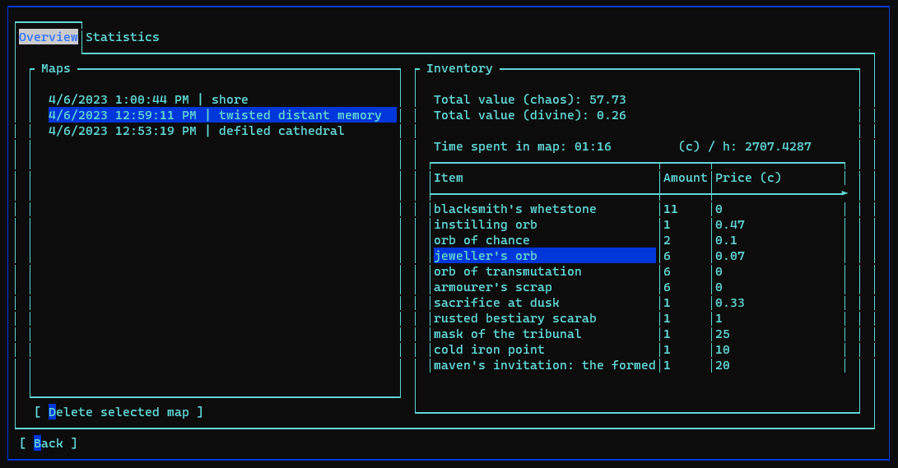
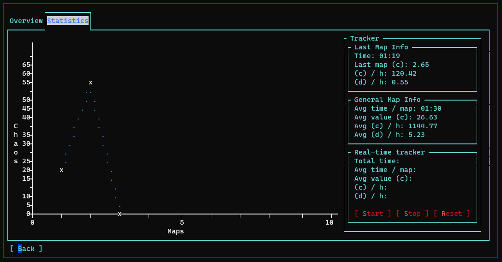
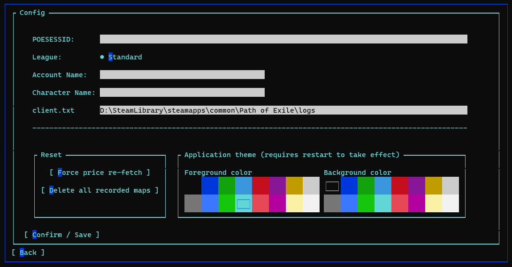

```
__/\\\_______/\\\___/\\\\\\\\\\\___/\\\_______________/\\\\\\\\\\\\\\\_        
 _\///\\\___/\\\/___\/////\\\///___\/\\\______________\/\\\///////////__       
  ___\///\\\\\\/_________\/\\\______\/\\\______________\/\\\_____________      
   _____\//\\\\___________\/\\\______\/\\\______________\/\\\\\\\\\\\_____     
    ______\/\\\\___________\/\\\______\/\\\______________\/\\\///////______    
     ______/\\\\\\__________\/\\\______\/\\\______________\/\\\_____________   
      ____/\\\////\\\________\/\\\______\/\\\______________\/\\\_____________  
       __/\\\/___\///\\\___/\\\\\\\\\\\__\/\\\\\\\\\\\\\\\__\/\\\\\\\\\\\\\\\_ 
        _\///_______\///___\///////////___\///////////////___\///////////////__
```

 [](https://stackoverflow.com/questions/61071158/add-image-with-link-in-githubs-readme-md)


## Usage

* To track maps go to the __Maps__ section from the main menu.
    * After entering this menu, all subsequent maps will be tracked.
* If you wish to track a secific subset of maps independently you can use the real time tracker.
* In order to end the last map of your session before quitting Path of Exile you can whisper yourself "end" to end the map.
* If your map somehow got corrupted and won't display right you can delete it from the map overview by clicking the button that says __[ Delete selected map ]__.
* To handle other errors you can delete all recorded maps from the __Config__ menu.
* To update the prices of items you can force a re-fetch of all price lists in the __Config__ menu.
    * Note that this __won't__ change the prices of items in already recorded maps!

<br>
<br>

Maps overview             |  Statistics overview
:-------------------------:|:-------------------------:
  |  

<br>
<br>

## Currently supported features:
* __Map tracking__
    - __General overview__
        * Items obtained in map with their respective poeNinja value
        * Time spent in map
        * Chaos per hour in this map
        * Divine per hour in this map

    - __Statistical overview__
        * Revenue graph
        * Overall data like:
            * Average time per map
            * Average currency obtained in map 
            * Average chaos/divine per hour
    
    - __Real-time map tracking__
        * Start & Stop functions
        * Projected chaos/divine per hour
        * Average time per map
        * Average vlaue per map

* Serialization
    * All maps are serialized with item prices at the time of recording.

* __Handled cases__
    * Leaving and entering the same map multiple times.
    * Going to another hideout and continuing an old map
    * Clearing inventory between the same map.
    * Trading in other hideouts during a map.
    * Going to act areas or towns

<br>
<br>

# Configuration guide
<p align="center">

</p>

___

If you have ever used a similar software to track Path of Exile data, the process is __identical__ to those. 


The POESESSID field requires the session ID from the PoE cookie.

Steps for obtaining the session ID in [Google Chrome](https://www.google.com/chrome/): 

1. Go to the official [Path of Exile](https://www.pathofexile.com)  website and log in. 
2. Press __F12__ to open the website inspector.
3. Head to the __Application__ tab located at the very top of the inspector window.
4. Select the __Cookies__ dropdown menu in the __Storage__ section of the inspector window.  
It is located at the left side of the inspector window.
5. Select the cookie that says `https://www.pathofexile.com`
6. In the list select and copy the __Value__ of __POESESSID__  
(This should be a string of numbers and lower case characters)
7. Pase this string into the POESSID field in the Config menu of XileConsole.


__MAKE SURE YOU COPIED THE WHOLE STRING__ <- double check this or the program will throw an exception.

___

The __account name__ field requires the name of your account.

The __character name__ requires the name of the character to track.

___

The client.txt field requires the absolute path to your client.txt file.

Steps for obtaining the path to the client.txt file.

If you are using __Steam__:

1. Go to the steam and right click the Path of Exile entry in the list.
2. Select properties.
3. Go to the __local files__ section and click __browse__.
4. In the opened explorer window go the subfolder __logs__.
5. Click into the bar the displays the path to this file, select the whole string and copy it.
6. Pase this string into the field next to client.txt in the XileConsole Config menu.

__MAKE SURE YOU COPIED THE WHOLE STRING__ <- double check this or the program will throw an exception.

After filling out all the textboxes hit the button that says __[ Confirm / Save ]__


<br>
<br>


